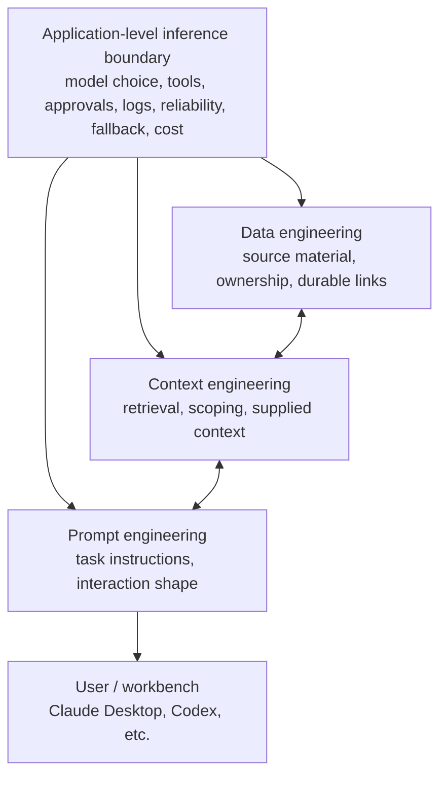
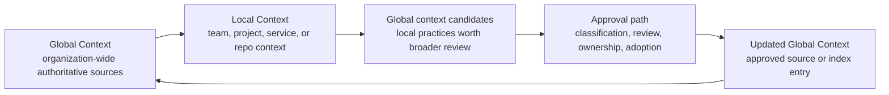
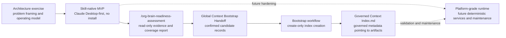
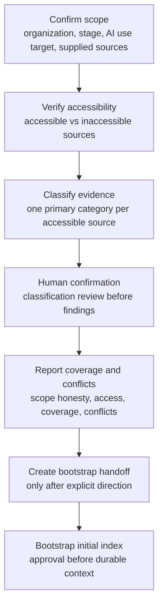

# Governed AI Context Before Agentic Automation
AI adoption fails when tools, context, permissions, and local workflows spread faster than governance. This case study describes a personal project I built to explore a practical operating model for AI-ready organizational context: how to assess what an AI system can safely rely on before giving it broader access, write permissions, or automation authority. The project started as an architecture exercise and became a skill-native prototype for assessing and bootstrapping governed organizational context.

## How I Got Here
In addition to being generally curious, with some healthy paranoia, about the current state of artificial intelligence, I wanted to explain the motivation behind this work. I had been reading long-form studies, watching presentations and demos, and observing failure modes where AI use produced task failures or degraded outputs. The moment that pushed me from thinking to building was trying to prompt-engineer a Gemini-based workflow to summarize a Slack channel going back 365 days. I will spare the minutiae, but it felt hacky enough that I said out loud, "There has to be a better way than forcing this burden on an end user." So I started drawing, testing, and prototyping.

## Executive Summary
**Disclaimer**: This is a personal case study, not professional advice or a universal framework. It reflects my current thinking and experience with a specific problem space.

The core thesis is simple:

> Governed context first; bounded capability second.

Before AI capabilities can safely act across tools and workflows, an organization needs to know what those capabilities should be allowed to know, which sources are authoritative, who owns those sources, how conflicts are resolved, and where human approval is required.

I designed this project around that sequence:
1. Assess the supplied organizational context.
2. Treat only retrievable sources as evidence.
3. Classify evidence into a fixed governance taxonomy.
4. Surface missing, inaccessible, or conflicting context without inventing confidence.
5. Require explicit approval before creating durable organizational AI context.
6. Bootstrap an initial index that points to authoritative artifacts without moving or rewriting those artifacts.

## The Problem
Most organizations do not fail at AI adoption because they lack access to models. They fail because the surrounding operating model is unclear. Carnegie Mellon's Software Engineering Institute, in collaboration with Accenture, published a [recent AI Adoption Maturity Model](https://www.sei.cmu.edu/library/ai-adoption-maturity-model/) that highlights the practical friction behind AI adoption, including a survey of nearly 600 practitioners. The most common factors negatively impacting AI adoption included:
- lack of appropriate data (35% of respondents)
- insufficient knowledgeable staff (34% of respondents)
- integration with legacy systems (32% of respondents)

Common failure modes include:
- Staff create disconnected prompts and duplicated workflows.
- AI outputs inherit stale, conflicting, or unowned context.
- Teams connect AI to tools before permissions and source-of-truth boundaries are clear.
- Generated drafts get mistaken for approved policy or operating guidance.
- Local team workflows drift away from organization-wide rules.
- Leaders gain more reporting noise instead of better operating visibility.

The security question is not only, "Is this AI feature safe?" It is also:
- What can the agent know?
- What can it reach?
- What can it write?
- Whose rules does it follow?
- Which source wins when documents disagree?
- What requires human approval?
- What gets logged, reviewed, or rolled back?

## What I Mean by Governance
Definitions of "Governance" vary so I feel it is important to clarify what I mean by that term. In this project, Governance does not mean turning AI adoption into a draconian policy exercise. It means giving the organization enough structure to succeed while simultaneously being secure.

Governance answers practical questions such as:
- What knowledge is approved for AI use?
- Which sources are authoritative?
- Which local workflows can diverge from global rules?
- What permissions should tools, plugins, and connectors have?
- Where should human judgment remain in the loop?
- How do we preserve employee trust and avoid surveillance-shaped systems?

Proper Governance should make AI safer, more useful and productive at the same time.

## System Model
I organized the system into four layers:
- **Data engineering**: trustworthy source material, document structure, ownership, and durable links.
- **Context engineering**: selecting, scoping, retrieving, and supplying the right material for a task.
- **Prompt engineering**: shaping the interaction, task instructions, and output format.
- **Application-level inference boundary**: the runtime boundary where model choice, tool access, approval gates, logging, reliability, fallback, and cost controls meet. I am not running my own "on-premise" AI infrastructure and use tools where that is abstracted away from me, which is why this is where my focus has been as it relates to inference engineering.

My focus started with data engineering, then moved into context engineering, and only then into prompt engineering. The goal is to reduce how much burden the end user has to bear by giving the AI system a stronger governed foundation. It also maintains enough flexibility for the end user to produce outputs that meet their own preferences.

## Global and Local Context
I describe the two main context layers as **Global Context** and **Local Context**.

### Global Context
Global Context is meant to be a global, organization-wide, governed context that AI tools can rely on across teams. These are things that you can authoritatively state should be accessible by anyone in the organization. The project taxonomy includes categories such as the following which are not mandatory for an organization, I simply started here to establish a common ground to work off of:
- **Company identity:** mission, values, operating principles, strategy.
- **Policy set:** security, privacy, HR, legal, finance, procurement, AI usage.
- **Core procedures:** work approval, decision-making, sensitive-information handling, incident or escalation response.
- **Operating plan:** annual plan, OKRs, goals, initiatives, owners.
- **Org model:** teams, roles, decision rights, DRI/RACI map.
- **Systems map:** tools in use, systems of record, data owners, integrations.
- **Workflow catalog:** recurring business processes, approvals, handoffs, cadences.
- **Decision records:** important decisions, rationale, date, owner, reversibility.
- **Knowledge lifecycle rules:** expiration, review, archive, ownership cadence.
- **Metrics dictionary:** canonical KPIs, definitions, formulas, dashboards.
- **Product/customer context:** product strategy, roadmap, ICP, customer commitments.
- **Risk register:** enterprise risk inventory and compliance obligations.
- **Standards/playbooks:** engineering, sales, support, hiring, and similar operating playbooks. 

### Local Context
Local Context is team-specific or project-specific context that refers back to Global Context. It can include local workflows, project systems, service context maps, team operating rules, and implementation details. Local Context can produce candidates for Global Context, but it is not global truth by default. That distinction matters: a useful team practice should not silently become organization-wide guidance without review.

## What I Built
My project has two product tracks and the Skill-native MVP is where things stand today:
- **Skill-native MVP**: a business-user path designed to run inside a single Claude Desktop session, with no package install and no terminal commands.
- **Platform-grade runtime**: a Python package that explores deterministic governance mechanics for future local agents, scheduled maintenance, enterprise services, or admin tooling.

Longer term, I would like this system to run with closed or open source models using the model, workbench, harness, or runtime of the organization's choosing. Personally, I would also like to be able to run the full system on my own infrastructure with an open model.

### Skill 1: Org Brain Readiness Assessment

`/org-brain-readiness-assessment` runs a guided, human-in-the-loop assessment over supplied organizational sources.

It asks for:
- Organization name.
- Company stage: startup, scaling company, mature company, or regulated enterprise.
- AI use target: personal productivity, read-only knowledge access, role-based workflow copilots, human-approved write-back, or bounded automation.
- Supplied sources: links or files the user wants assessed.

Then it:
- Verifies source accessibility.
- Treats only accessible supplied sources as evidence.
- Rejects pasted snippets, summaries, and manually rewritten content as evidence.
- Classifies each evidence item into exactly one fixed category.
- Asks the user to confirm or correct classification before coverage findings are made.
- Reports inaccessible sources separately.
- Surfaces category coverage, access considerations, coverage considerations, and conflicting supplied sources.
- Avoids numeric scores, maturity labels, safe-pilot claims, or unsupported confidence.

The assessment is read-only by default. It does not create an index, adopt artifacts, persist state, or write to external systems unless the user explicitly directs durable assessment-output creation after the final report.

### Skill 2: Global Context Bootstrap

The bootstrap workflow consumes a confirmed Bootstrap Handoff and creates the initial governed context index.

The bootstrap skill is intentionally narrow:
- It is create-only.
- It does not overwrite, merge, or append to an existing index.
- It does not reselect or reclassify sources.
- It does not recheck source accessibility.
- It does not move, edit, copy, or re-host source artifacts.
- It creates index entries by reference through durable artifact links.
- It requires explicit confirmation before creating the index.

The index records governance metadata about artifacts. It does not store the full artifact content.

## Walkthrough Scenario

The concrete scenario is an organization preparing to use AI for more than ad hoc personal productivity. Before connecting AI to workflows, the organization wants to know whether it has enough trusted context for role-based copilots, human-approved write-back, or bounded automation.

The workflow proceeds in seven steps.

### 1. Confirm Scope
The assessment confirms the organization, company stage, AI use target, and supplied sources. The AI use target calibrates wording and prioritization, but it is not treated as a maturity level.

### 2. Verify Accessibility
Each supplied source receives a retrieval status:
- `Accessible`: the source was retrieved and read during the assessment.
- `Inaccessible`: the source could not be retrieved or parsed.

After accessible evidence is classified, categories with no mapped evidence are marked `Not Supplied`. This avoids treating an inaccessible source as evidence for category coverage. For connector-backed sources, the assessment distinguishes connector availability, permission failures, fetch failures, and parse failures. That distinction matters because each failure has a different remediation path.

### 3. Classify Evidence
Only accessible sources become evidence. Each evidence item is mapped to one primary category in the 13-category taxonomy. The assessment also records evidence character, such as organization-specific, blank template, third-party reference, other-organization example, or unclear.

### 4. Ask for Human Confirmation
The classification review is a deliberate control point. The system proposes classification, but the user confirms or corrects it before category coverage findings are made. This prevents the assessment from turning model inference into governance fact.

### 5. Report Coverage and Conflicts
The final report includes:
- Assessment scope.
- Supplied sources.
- Retrieval status.
- Classification review.
- Category coverage.
- Access considerations.
- Coverage considerations.
- Conflicting supplied sources.
- Suggested next additions.
- Optional draft starters.
- Global Context intake handoff.

Conflict detection is intentionally scoped. The assessment flags conflicts only when two or more accessible evidence items in the same category directly disagree on current policy, ownership, goals, procedures, system of record, permissions, or another material fact.

### 6. Create a Bootstrap Handoff
After the report, the user can explicitly ask to create durable assessment-output files: the Assessment Report and a Global Context Bootstrap Handoff. The handoff carries confirmed Candidate Records only. It excludes coverage considerations, suggested next additions, optional draft starters, inaccessible sources, and unconfirmed classifications.

### 7. Bootstrap the Initial Index
The bootstrap workflow consumes the handoff and creates one governed context index file in the confirmed storage location. Each index entry includes fields such as:
- Index Entry ID.
- Artifact Title.
- Artifact Link.
- Source Native ID.
- Category.
- Owner.
- Accessibility.
- Last Updated.
- Description.

The index is the governed record. The artifacts remain where they already live.

## Security and Governance Controls
The project encodes several controls that I would expect in an AI-forward security operating model:
- **Scope honesty**: the system only claims what accessible evidence supports. It does not infer from private URLs, filenames, pasted snippets, user summaries, or inaccessible documents.
- **Read-only by default**: the assessment does not write authoritative state by default. It can identify candidate records, but durable output and bootstrap require explicit user direction.
- **Human approval gates**: classification review, durable handoff creation, and bootstrap confirmation are separate human checkpoints.
- **No silent adoption**: generated drafts, assessment outputs, local context, and supplied sources do not become Global Context just because the system saw them. Adoption requires a separate action.
- **Source provenance**: the system keeps source links, source-native IDs when available, retrieval status, category, and descriptions attached to candidate records and index entries.
- **Artifact boundaries**: the project owns the index entry, not the artifact. It does not move, rewrite, or re-host source material.
- **Permission awareness**: the project distinguishes intended organizational visibility from actual host-provider permissions. Creating an index does not grant access to the storage location or linked artifacts.
- **Conflict visibility**: conflicts between accessible sources are surfaced before anything is approved for global context.
- **No false precision**: the assessment avoids numeric scoring, maturity labels, and broad safe-pilot claims. This keeps the output grounded in observed evidence.

## Key Design Decisions
The project reflects a few deliberate product and security choices:
- **Skill-native first**: the first usable version runs in a business-user workbench rather than requiring a backend service. This lowers adoption friction and makes the workflow demonstrable without procurement, deployment, or setup.
- **Google Workspace Shared Drive as the default storage target**: for v1, a Shared Drive is the default Global Context storage location because it gives the organization a durable shared place for assessment output, bootstrap handoffs, artifacts, and the initial index. Other links and uploads remain acceptable supplied sources, but session-local uploads are not bootstrap-ready unless staged somewhere durable.
- **Single-file index for the MVP**: the skill-native MVP creates one governed context index file. This trades richer platform mechanics for a low-friction first adoption path. The Python runtime remains future platform-grade infrastructure.
- **Separate assessment from bootstrap**: assessment determines what was observed. Bootstrap creates governed index state. Keeping those separate prevents the assessment from silently becoming an adoption mechanism.
- **Fixed taxonomy**: the MVP uses 13 fixed categories. This avoids ad hoc classification drift while still covering the core operating context an AI system needs to reason about an organization.

## Leadership Lessons
The project reinforced a few leadership patterns that matter for AI-forward security work:
- **AI enablement is a security leadership problem**: agentic systems change the shape of security work. The question is no longer only whether a feature is secure. It is whether the organization has made knowledge, permissions, approvals, and accountability inspectable before automation scales.
- **Governance should reduce user burden**: strong data and context engineering reduce the amount of prompt engineering every end user has to do. That is a productivity benefit and a security benefit.
- **Trust requires clear boundaries**: employees and leaders need to know what the system will and will not do. The project explicitly avoids surveillance-shaped behavior, invisible writes, and unreviewed adoption of generated material.
- **Evidence and recommendations must stay separate**: a useful AI governance workflow must distinguish what was observed from what the system suggests doing next. Otherwise, generated advice can masquerade as evidence.
- **Adoption should be incremental**: the project does not try to replace systems of record or crawl the organization automatically. It starts with supplied sources, verifies access, creates a report, and then asks for explicit approval before any durable context is created.

## What This Demonstrates
This case study is less about a single tool and more about an operating pattern:
- Translate ambiguous AI risk into concrete workflow boundaries.
- Build governance into the path of least resistance.
- Treat context as infrastructure for safe automation.
- Make security, privacy, and productivity reinforce each other.
- Preserve human judgment at the points where authority changes.

In an AI-forward organization, this kind of operating model matters because agents will increasingly sit between users, systems of record, customer commitments, and automated workflows. The more useful those agents become, the more important it is to govern what they know before expanding what they can do.

## Source Artifacts
- SEI AI Adoption Maturity Model: https://www.sei.cmu.edu/library/ai-adoption-maturity-model/
- [How Bridgewater Built Pat, The AI Pocket Analyst Tool | Interrupt 26](https://www.youtube.com/watch?v=lXZb21CfeIY)

## What's Next
I have a working prototype for the initial bootstrap and for establishing Global Context in a reasonable way. What comes next is curating that context and orchestrating change management around artifacts so Global Context stays healthy and usable. This will at minimum consist of:
- Skill-based workflows to add a new record and update the index while maintaining the existing guardrails for access, ambiguity, conflict, etc.
- Evolving the MVP index into a richer retrieval and maintenance layer.
- Running "refresh" workflows for the Global Context to maintain currency.
- Building capabilities to more easily bootstrap Local Contexts.

Stay tuned!
